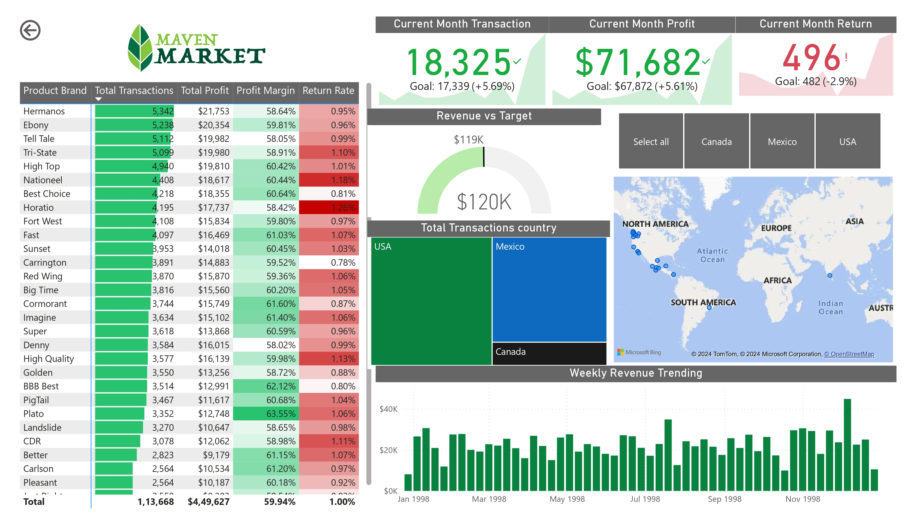
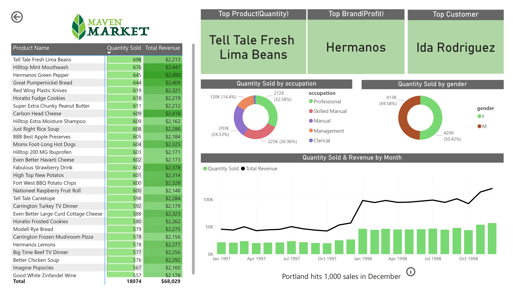

# MavenMarket

### Introduction
This project involves creating a business intelligence report for Maven Market, a multi-national grocery chain with locations in Canada, Mexico, and the United States. The goal is to analyze sales, profit margins, return rates, and other key performance indicators across different regions and product categories.

### Steps Involved

1. **Connecting to Data Sources**
    - **Data Source Identification**: Identify the various data sources needed, such as sales transactions, product details, customer demographics, and regional data.
    - **Connecting to Data Sources**: Connect to these data sources in Power BI using built-in connectors for databases, files, and cloud services.

2. **Data Transformation and Shaping**
    - **Data Cleaning**: Clean the data to handle missing values, remove duplicates, and correct any inconsistencies.
    - **Data Transformation**: Shape the data using Power Query Editor by performing transformations such as filtering rows, pivoting columns, and merging datasets.

3. **Building a Relational Data Model**
    - **Creating Relationships**: Establish relationships between tables based on common keys (e.g., ProductID, CustomerID).
    - **Data Model Optimization**: Optimize the data model by setting appropriate data types, removing unnecessary columns, and creating hierarchies for easier data analysis.

4. **Adding Calculated Columns and Measures**
    - **Calculated Columns**: Add calculated columns to enrich the data model, such as calculating profit by subtracting costs from revenue.
    - **Measures**: Create DAX measures for key metrics like Total Transactions, Total Profit, Profit Margin, Return Rate, and Monthly Goals.

5. **Designing the Interactive Report**
    - **Report Layout**: Design a user-friendly report layout with a clear structure, including filters, charts, and tables for easy navigation.
    - **Visualizations**: Create various visualizations such as bar charts, line graphs, and pie charts to represent key metrics and trends.
    - **Interactivity**: Add interactive elements like slicers, drill-throughs, and tooltips to enhance the report's usability.

6. **Key Metrics and Visualizations**
    - **Product Performance**: Visualizations for product performance by brand, including Total Transactions, Total Profit, Profit Margin, and Return Rate.
    - **Regional Performance**: Charts showing Total Transactions and Profit by country (USA, Mexico, Canada).
    - **Monthly Trends**: Line graphs depicting weekly revenue trends and monthly revenue vs. target.
    - **Top Products and Customers**: Tables listing top products by quantity sold and revenue, and top customers.

### Report Insights
1. **Overall Performance**: Summary of overall performance metrics, including total transactions, total profit, and profit margin.
2. **Top Performing Brands and Products**: Insights into which brands and products are performing best in terms of sales and profit.
3. **Regional Analysis**: Analysis of sales performance across different regions.
4. **Customer Segmentation**: Breakdown of sales by customer demographics like occupation and gender.

### Conclusion
This Power BI report for Maven Market provides a comprehensive view of the company's sales performance across different regions and product categories. It helps in identifying key trends, top-performing products, and areas for improvement.

### Report

### Files Included
- `MavenMarket.pbix`: The Power BI report file.
- `README.md`: This README file with detailed instructions.

